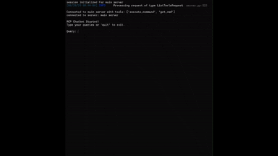

# 🧠 AutoShell: Smart Terminal Assistant (MVP)

AutoShell is a minimal, intelligent Linux shell assistant that uses GPT-based reasoning to interpret and execute user queries via terminal commands. It supports basic automation and system inspection, all through natural language.

This is a **Minimum Viable Product (MVP)** with limited support for standard commands like `ls`, `pwd`, `cd`, and simple system utilities.

---

## ✨ Demo

  
<sub>Demo: Listing directory contents, checking CWD, and reading outputs interactively.</sub>

---

## 🧩 Components

### 🔹 1. `mcp_server.py`
- Core MCP server that wraps subprocess-based shell sessions.
- Registers tools like `run` and `cwd`.

### 🔹 2. `session/subprocess_session.py`
- Maintains a persistent bash subprocess.
- Exposes low-level methods for:
  - Writing to stdin
  - Reading stdout/stderr
  - Fetching exit codes
  - Flushing buffers

### 🔹 3. `tools/`
- High-level tools like:
  - `run_command.py`: Run and return command outputs.
  - `get_cwd.py`: Return current directory.

### 🔹 4. `client.py`
- Starts the chatbot interface using `mcp.ClientSession` and OpenAI's GPT-4o-mini via Azure.
- Maintains a message history and interactive CLI for the user.

---

## ⚙️ Setup

### 1. Clone the repo

```bash
git clone https://github.com/your-username/AutoShell.git
cd AutoShell
